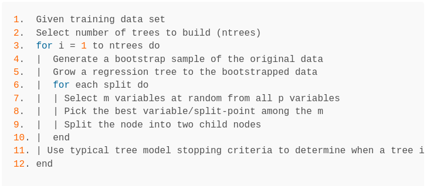

```{r setup, include=FALSE}
knitr::opts_chunk$set(echo = TRUE)
library(dplyr)
library(rsample)      # data splitting 
library(randomForest) # basic implementation
library(caret)        # an aggregator package for performing many machine learning models
library(scales)
library(distr)
library(caret)
library(ranger)

```

## Overview 

1. Background

    Trees vs. Forsets; Random Forest Algorithm; Advatanges / Distadvantages

2. Basic Implementation

    Dataset & research problem; Model basics & key terms (OOB error & parameters); Tuning; Prediction; Variable Importance

3. Gotchas

    Imbalanced samples; Variable importance validation; Multicollinearity

4. Resources & further reading

<!-- ## Generalized Model for Decision Trees and Random Forests-->

<!-- 1. Stratify the predictors' space into regions using binary splitting rules (decision trees) -->
<!-- 2. Select the predictor and the cutpoint such that the split leads to the greatest reduction in the variance of the outcome -->
<!-- 3. For each region found, predict either the mean of Y in the region (continuous case) or the most common class (classification case) -->
<!-- 4. Continue until some criterion is reached (e.g. no region contains more than 5 observations) -->

## Trees vs Forests

| Decision Tree | Random Forest |
| ---- | ---- |
| Single tree | Collection of different trees |
| Uses entire dataset | Uses boostrapped data |
| Uses all features | Uses subsets of features | 
| One tree determines prediction | All trees contribute to prediction |

## Random Forest Algorithm

The basic algorithm for a regression random forest can be generalized to the following:


(from [UC Business Analytics R Programming Guide](https://uc-r.github.io/random_forests))

## Advantages & Disadvantages

| Advantages | Disadvantages |
| ---- | ---- |
| Good performance | Advanced boosting algorithms can perform better |
| “out-of-the box” | Slow on large data sets |
| Built-in validation set | Not very interpretable | 
| Robust to outliers |  |

```{r create fake dataset, echo = FALSE}

# library(distr)
# library(scales)
# 
# set.seed(20200915)
# 
# df <- data.frame(age = rescale(r(Norm(mean = 35, sd = 10))(1000), to = c(21, 65)),
#                  cotm = as.factor(c(rep(1,100),
#                           rep(0, 900))),
#                  weekly_routine = c(rep("school",60), rep("work",30), rep("none",10),
#                                     rep("school",200), rep("work",200), rep("none",500)),
#                  weekend_fun = rescale(c(r(Norm(mean = 8, sd = 2))(100),
#                                  r(Norm(mean = 6, sd = 4))(900)), to = c(1,10)),
#                  weekend_alc_consumption = rescale(c(r(Norm(mean = 7.5, sd = 1.5))(100),
#                                              r(Norm(mean = 6.6, sd = 2))(900)), to = c(1,10)),
#                  like_work  = rescale(c(r(Norm(mean = 4, sd = 3))(100),
#                                 r(Norm(mean = 6, sd = 3.5))(900)), to = c(1,10)),
#                  like_boss  = rescale(c(r(Norm(mean = 5, sd = 2.5))(100),
#                                 r(Norm(mean = 6, sd = 2))(900)), to = c(1,10)),
#                  like_colleagues = rescale(c(r(Norm(mean = 5, sd = 3))(100),
#                                      r(Norm(mean = 7, sd = 2))(900)), to = c(1,10)),
#                  work_stress = rescale(c(r(Norm(mean = 5, sd = 2))(100),
#                                  r(Norm(mean = 3, sd = 2))(900)), to = c(1,10)),
#                  health_status = rescale(c(r(Norm(mean = 7, sd = 2.5))(100),
#                                    r(Norm(mean = 6, sd = 2))(900)), to = c(1,10)),
#                  financial_status = rescale(r(Norm(mean = 5, sd = 3))(1000), to = c(1,10)),
#                  social_support = rescale(r(Norm(mean = 6, sd = 3))(1000), to = c(1,10)))
# save(df, file = "df.RData")
# 
load("df.RData")

```

# Basic Implementation

## Dataset: The Case of the Mondays (COTM)

Ficticious scientists conducted a ficticious survey of 1000 ficticious people, collecting the following variables of interest: 

- Age
- Weekly routine (does the person have a regular routine of school/work or not?)
- How much fun is had on weekends
- Alcohol consumption on weekends
- How much work, boss and colleagues are liked
- How much work stress is experienced
- Health, Financial and Social support status

# Who will get COTM?

## Train & Test Samples

```{r, echo = TRUE}
set.seed(123)   # for reproduciblity

train <- sample(1:nrow(df), .67*nrow(df))

df_train <- df[train,]
df_test <- df[-train,]

```


## Model

```{r, echo = TRUE}
set.seed(123)   # for reproduciblity

rf <- randomForest(formula =  cotm ~ ., data  = df)

rf
```

<!-- ## Out-of-bag estimate of error -->

<!-- - Each decision tree in the forest uses subsample for 'training' (in-bag sample) and tests the model on a 'test' subsample (out-of-bag sample) -->
<!-- - The errors from the out-of-bag samples are aggregated, resulting in an overall estimate of errors per class -->
<!-- - OOB estimate of error rate = count of misclassifications (14 non-COTM instances, and 66 COTM instances) divided by number of observations (80/1000 = 8%). -->

## Model Parameters

```{r, echo = TRUE}
set.seed(123)   # for reproduciblity

rf_formula = paste0("cotm ~ ",
                    paste0(colnames(df[,-2]), collapse = " + "))

rf1 <- randomForest(formula =  as.formula(rf_formula), 
                   data  = df,
                   ntree = 300,   # number of trees
                   mtry = 2,      # number of vars sampled per split
                   sampsize = 500, # size of samples to draw
                   nodesize = 3)   # minimum number of terminal nodes
```

## Tuning

(see [UC Business Analytics tutorial](https://uc-r.github.io/random_forests#tune) and [Julia Silge's tutorial](https://juliasilge.com/blog/sf-trees-random-tuning/) for more info on tuning)

```{r, echo = TRUE}
# library(ranger)

# hyperparameter grid search
hyper_grid <- expand.grid(
  num_trees = seq(400,600, by = 50),
  mtry       = seq(2, 11, by = 2),
  node_size  = seq(3, 9, by = 2),
  sample_size = c(.55, .632, .70, .80),
  OOB_RMSE   = 0
)

```

Total number of combinations: `r nrow(hyper_grid)`

## Tuning

```{r, echo = TRUE}
for(i in 1:nrow(hyper_grid)) {
  
  # train model
  model <- ranger(
    formula         = cotm ~ ., 
    data            = df, 
    num.trees       = hyper_grid$num_trees[i],
    mtry            = hyper_grid$mtry[i],
    min.node.size   = hyper_grid$node_size[i],
    sample.fraction = hyper_grid$sample_size[i],
    seed            = 123
  )
  
  # add OOB error to grid
  hyper_grid$OOB_RMSE[i] <- sqrt(model$prediction.error)
}
```

## Tuning

```{r, echo = TRUE}
hyper_grid <- hyper_grid %>% 
  dplyr::arrange(OOB_RMSE)

head(hyper_grid, 5)
```

## Tuning 

```{r, echo = TRUE}
set.seed(123)
rf2 <- randomForest(formula = as.formula(rf_formula), data  = df,
                   ntree = hyper_grid$num_trees[1], mtry = hyper_grid$mtry[1],
                   sampsize = ceiling(hyper_grid$sample_size[1]*nrow(df)),
                   nodesize = hyper_grid$node_size[1], importance = TRUE)
rf2
```

## Prediction 

```{r, echo = TRUE}
predicted_values <- predict(rf, df_test)
confusionMatrix(predicted_values, df_test$cotm)$table
```

## Variable importance

```{r, echo = FALSE}
varImpPlot(rf2, type = 1)
```

- Accuracy: For each variable, scramble the values (maintaining its distribution), build a tree, and assess its accuracy; the loss of accuracy from doing this is the Mean Decrease in Accuracy.

## Variable importance

```{r, echo = FALSE}
varImpPlot(rf2, type = 2)
```

- Gini importance (purity): The model searches for the variable to split where the split gives the lowest Gini index (lower is 
‘purer’). If the variable is useful, it tends to split mixed labeled nodes into pure single class nodes.


# Gotchas

## Imbalanced samples

```{r, echo = FALSE}

df_train_balanced <- rbind(
  df_train[df_train$cotm == 1,],
  df_train[sample(which(df_train$cotm == 0), length(which(df_train$cotm == 1))), ])
# table(df_train_balanced$cotm)
```

```{r, echo = TRUE}
set.seed(123)
rf <- randomForest(formula =  cotm ~ ., data  = df_train_balanced)
rf
```

## Some solutions

(see [this tech report](https://statistics.berkeley.edu/sites/default/files/tech-reports/666.pdf) for additional info)

1. Balance data via under/over sampling
2. Add weights to random forest model
3. Quantile-classifer (RFQ) approach

Package `randomForestSRC` has implementations for 2 & 3

## Validation of variable importance 

```{r, echo = FALSE}

df_train_balanced$random_var1 <- rescale(r(Norm(mean = 7, sd = 3))(nrow(df_train_balanced)), to = c(1,10))
df_train_balanced$random_var2 <- sample(c(1:4), nrow(df_train_balanced), replace = T)
set.seed(123)
rf <- randomForest(formula =  cotm ~ ., data  = df_train_balanced,
                   importance = TRUE)
varImpPlot(rf)
```

## Correlated predictors

Random forests can be sensitive to correlated predictors; this is particularly problematic when using random forest for variable selection. Some alternatives:

1. Conditional Inference Forests (`partykit::cforest`)
2. Boruta (`Boruta::Boruta`)

## Additional resources:

- [Elements of statistical learning](https://web.stanford.edu/~hastie/Papers/ESLII.pdf)
- [Leo Breiman: Random Forests, 2001 paper](https://www.stat.berkeley.edu/~breiman/randomforest2001.pdf)
- https://uc-r.github.io/random_forests
- https://www.blopig.com/blog/2017/04/a-very-basic-introduction-to-random-forests-using-r/

